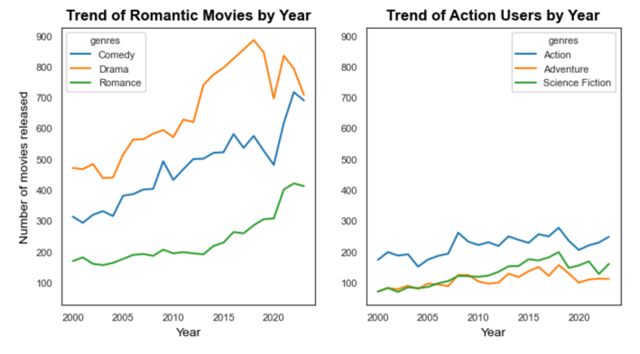

## Udacity Data Science Nanodegree
---
## Capstone Project: Movie Recommendation Web Application

#### Created by: Juanita Smith
#### Last date: April 2025

---

This project was completed as part of the 
[Data Science Nanodegree](https://www.udacity.com/enrollment/nd025) with Udacity.

This nanodegree mainly focused on effective communication with stakeholders,
building good coding practices for data scientists, 
and building recommendation systems.

My final capstone project brings together key concepts I learned in this course:

- Follow CRISP-DM Process (Cross Industry Process for Data Mining)
- **Software Engineering**: Use object-oriented programming 
  to build my own classes and packages and using them in a web application
- **Data Engineering**: Building ETL and NLP pipelines 
  to gather, clean, and transform data
- **Recommendations systems**:
  Building a movie recommendation webapp using ranked-based,
  user-based collaborative filtering and NLP content-based algorithms.

### Table of contents

* [1. Project Overview](#1-project-overview)
* [2. Udacity Project requirements](#2-udacity-project-requirements)
* [3. Installation](#3-installation)
* [4. Instructions](#4-instructions)
* [5. Language translator with CHATGPT (optional step)](#5-language-translator-with-chatgpt-optional-step)
* [6. Input File Descriptions](#6-input-file-descriptions)
* [7. Modelling](#7-modelling)
  * [Data cleaning](#data-cleaning)
  * [Modelling approach](#modelling-approach)
    * [Dealing with Imbalance](#dealing-with-imbalance)
    * [Cross-validation](#cross-validation)
    * [Evaluation metrics](#evaluation-metrics)
    * [Model performance](#model-performance)
* [8. Flask Web App](#8-flask-web-app)
* [9. Skills learned:](#9-skills-learned)
* [10. Licensing, Authors, Acknowledgements](#10-licensing-authors-acknowledgementsa-namelicensinga)
* [11. References](#11-references)

# 1. Project Definition

## Project Overview

Build a movie recommendation web application by
using a blend of recommendation techniques such as ranked-based, content-based,
and collaborative filtering to make personalized movie recommendations to users.

Datasets containing over one million movies from TMDB and IMDB were sourced from Kaggle 
and blended with rating and tag data from MovieLens.

As all popular movie platforms like Netflix are customer-focused,
where an account is needed to watch movies,
and recommendations are personalized to the customer,
I will build the web application in the same spirit to be user-focussed.

Overview of the main steps of this project, following the CRISP-DM process:
(Cross Industry Process for Data Mining)

1) Business understanding: Design the scope and flow of the web application, which questions it should answer?
2) Data Understanding: Explore data sources available to answer the questions.
3) Data Preparation: Gather, wrangle, and analyze the data to prepare it for modeling. 
4) Data modeling: Design and refine recommendation algorithms.
5) Result evaluation: How well do we recommend movies to users?
6) Deployment: Communicate business insights through a web application

**Summary of the project approach:**

## Problem Statement

Build a movie recommendation web application
that accurately predicts movies a user is likely to enjoy,
based on their past viewing history and rating patterns.

Recommending the right movie to the right user
is a crucial skill to learn to ensure a positive user experience
that helps companies like Netflix retain their customers.

Building an accurate recommendation system brings the following challenges:

- Which data sources to use?
- Scalability: How to balance large data size vs web app performance?
- How to handle data sparsity?
- How to handle cold start problems for new users or 
  users with limited viewing history?
- How to measure success?

The project is divided into the following parts:

- Part 1—Preparation phase:
Use notebooks to first collect, clean and explore data,
then explore and test various movie recommendation techniques.

- Part 2: Build ETL and NLP pipelines for automated data wrangling
- Part 3: Transfer recommendation code from notebook to a recommender class and develop the web application

## Metrics

Different metrics are used for different recommendation algorithms:

#### Ranked-Based Metrics

  IMDB is often seen as the industry standard when it comes to movies;
  therefore, both 'IMDB number of votes' and 'IMDB average rating'
  were considered
  good choices to identify the top 20 most liked movies.
  
  Upon analysis, IMDB number of votes gave the best results,
  as it returned recognizable top movies known to me,
  with an average IMDB rating > 7.5.

**Top movies using IMDB number of votes:**

#### User-based Collaborative Filtering Metrics

Collaborative filtering focuses on neighborhood similarities,
meaning we look for similar users to the main user
and recommend movies the main user has not watched yet,
but his closest neighbors have.

Cosine similarity is used to find similar users. 

Cosine similarity measures the similarity between users 
based on the angle between their rating vectors, 
focusing on directional alignment rather than magnitude, 
making it robust to differences in scale and suitable for high-dimensional data. 

#### NLP Content-Based Metrics:

Another method we can use to make recommendations is
to recommend movies with the highest text-based cosine similarity 
to an input search term, using tfidf vectorization.

Cosine similarity measures the angle between two vectors.
The angle between similar vectors are close together.

Cosine similarity focus on the direction of vectors,
instead of magnitude,
making it useful for comparing text
that might have different lengths.

# 2. Installation
To clone the repository use `git clone https://github.com/JuanitaSmith/capstone_movie_recommendation.git`

- Project environment was built using Anaconda.
- Python 3.10 interpreter was used.
- Refer to `requirements.txt` for explicit libraries and versions needed to build your environment.
- Refer to `environment.yaml` for the full environment setup and channels used
- Note: Library `kaggle` and `kaggle-hub` was installed using pip as it's not available in conda

# 4. Instructions
Run the following commands in the project's **root directory** to set up your database and model.

A configuration file `src/config.pg` contains defaults for the project structure and file paths. 
Ideally don’t change this structure.

**IMPORTANT**: MAKE SURE ALL COMMANDS ARE RUN FROM THE TERMINAL IN THE MAIN PROJECT ROOT

python -m src.preprocessing_data_gathering
python -m src.preprocessing_data_cleaning
python -m src.preprocessing_nlp
python -m unittest tests.test_recommender
python runmovieapp.py  

# 2. Analysis

## Data Exploration

A blend of various data sources from IMDB, TMDB, and MovieLens were used.

#### 2.1 Kaggle TMDB/IMDb dataset containing content for over 1 million movies. 
   
See full documentation available
   [here](https://www.kaggle.com/datasets/alanvourch/tmdb-movies-daily-updates/data)

This dataset is refreshed daily 
and contains up-to-date data to release year 2025.
It contains 28 columns,
of which the following columns were selected for the project:

* title: Movie title (localized)
* overview: text overview of the movie
* status: Release status
* imdb_id: IMDB ID
* original language: ISO 639-1 language code
* overview: Short movie synopsis
* tagline: short captivating phrase for posters and trailers
* imdb_rating: IMDb average rating on scale 0–10
* imdb_votes: IMDb number of votes received
* poster_path: URL link to poster image
* release_date: Theatrical release date
* genres: List of Genres
* director: Movie director(s)
* producers: Movie producers
* production_companies: Main production companies

#### 2.2) MovieLens 32M
   
See documentation available [here](https://grouplens.org/datasets/movielens/32m/) or [here](https://files.grouplens.org/datasets/movielens/ml-32m.zip)

IMDb dataset doesn't have any ratings data by user id, 
which we need for user-item collaborative filtering.

The dataset contains 32 million ratings and two million tag applications applied to 87,585 movies by 200,948 users.
Collected 10/2023 Released 05/2024

The zip file contains several datasets,
of which the following are used in this project:

##### 2.2.1 links.csv

This dataset enables us to join data from TMDB, IMDB and MovieLens together.
In this project imdbId are used as the main unique identifier.

* movielens_id: MovieLens ID
* tmdb_id: TMDB ID
* imdbId: IMDb ID

##### 2.2.2. ratings.csv

This dataset contains movie ratings.

* user_id: user ID who gave the rating 
* movielens_id: MovieLens ID
* rating: MovieLens ratings on scale 0-5
* timestamp: Date rating was giving

##### 2.2.3 tags.csv

This dataset contains tags users gave to movies,
example 'disney', 'family', etc.

Columns used:

* user_id: user ID that tagged the movie
* movielens_id: MovieLens ID
* tag: tag text
* timestamp: date the movie was tagged

#### 2.3 Kaggle Extra IMDb data

Dataset has similar data as IMDB/TMDB dataset,
but with additional interesting columns.
This dataset is not kept up to date,
therefore, it wasn’t chosen as the main source.

Full documentation is available in Kaggler [here'](https://www.kaggle.com/datasets/shubhamchandra235/imdb-and-tmdb-movie-metadata-big-dataset-1m)

Columns used in the project:

* imdb_id: IMDb ID
* backdrop_path: image used for poster backdrops
* homepage: Movie homepage URL
* Star1: Name of main actor
* Star2: Name of main actor
* Star3: Name of main actor
* Star4: Name of main actor

## Exploratory Visualization

As the recommendation project is user-focused,
we need to find a way to evaluate the quality of the movie recommendations. 

Let's profile a user based on the genres they like most.

Drama, Comedy, and Thrillers seem to be the most popular genres.

Here we have two users that have totally different tastes in movies,
and should get totally different recommendations from our system.

Interestingly, the popularity of Comedy, Drama,
and Romance movies are showing an upwards growth,
whilst Action, Adventure, and Science Fiction movies are showing little growth.

# 3. Methodology

# 7. Modelling

## Data cleaning

Preparation notebook is stored in `notebooks/ETL Pipeline Preparation.ipynb`

The following data cleaning was completed:
- category 'child_alone' was dropped as it had all entries 'False', giving us no ability to learn
- clean categories so each category appear in its own column with binary indicator 1 or 0
- merge categories and messages datasets using 'id' as key to join
- id was set as a unique index, which is especially needed for language translation during OpenAI
- duplicated messages and indexes were dropped
- column 'original' was dropped as it's unnecessary for the model
- category `related` had 376 records that contained a non-binary value of '2', 
which was changed to '0' as no other categories contained true labels for such records.

## Modelling approach

Preparation notebook is stored in `notebooks/ML Pipeline Preparation.ipynb`
XGBOOST algorythm was used, as it now supports multi-label classification out of the box.

### Dealing with Imbalance
- To deal with imbalance labels, the following techniques were used:
  - Multi-label stratification split into test and train datasets, 
    using package [iterative-stratification](https://pypi.org/project/iterative-stratification/)
  - A new class `src/mloversampler.py` was developed to perform over-sampling 
    for minority classes in MULTI-LABEL classification problems by either duplicating records or using augmentation.
    The Level of duplication is determined by a ratio factor representing the severity of imbalance of each label.
    Example: label 'offer' is duplicated 20 times, whilst label security is duplicated 6 times.
  - A new custom `focal loss` function in class `src/focalloss.py` was developed
    to reduce the importance of the majority class. 
    This function is used as loss function in XGBOOST hyper parameter `eval_metric`.

Result after stratified split and oversampling: 
- Labels are evenly distributed in label datasets before and after stratified split.
- Oversampling is only applied to the training dataset, number of records increased from 17,452 to 30,815 in the notebook preparation.

### Cross-validation

During cross-validation, GridSearchCV was used for hyperparameter tuning as it was a project requirement.
Due to long runtimes, the grid search was restricted to `max_depth` and `n_estimators` only.

As a second step,
[OPTUNA](https://www.dailydoseofds.com/bayesian-optimization-for-hyperparameter-tuning/) 
was used for further hyperparameter tuning, as it's much faster.

Both Grid search and Random Search evaluate every hyperparameter configuration independently. 
Thus, they iteratively explore all hyperparameter configurations to find the most optimal one.

However, Bayesian Optimization takes informed steps based on the results of the previous hyperparameter configurations.
This lets it confidently discard non-optimal configurations. 
Consequently, the model converges to an optimal set of hyperparameters much faster.

### Evaluation metrics

**Precision macro** score was used as the main evaluation metrics. 
During a disaster, there are limited resources and services, 
and we want to send resources where we are sure it is necessary. 
Some messages are very vague and unclear.
It's not so easy to get a high precision macro score; it needs extensive engineering effort to get great results.

### Model performance

Model performance during training using **macro precision** as scoring, is increased after grid search.

Final model performance on test data is amazing with 0.84 micro precision and 0.86 macro performance !! 
Great performance on imbalanced labels.

# 8. Flask Web App

User can input a message, select the genre and click on the button 'Classify Message'.

The saved classification model will be used to classify the message.
All positive classes will be highlighted in green.

# 9. Skills learned:

Skills applied in this project:

- Web Development using Flask, Plotly and Software Engineering
- Clean and modular code, see custom modules and classes
- GIT version control
- Automated unit testing using library `unittest`, see folder `tests`
- Logging: see folder `logging` for logging results
- Introduction to Object-Oriented Programming - see `src/translator.py` and `mloversampler.py` for custom classes
- Data Engineering: Building pipelines using `scikit-learn` `Pipeline`

# 10. Licensing, Authors, Acknowledgements

Must give credit to Appen for the data.

* Movies dataset (Licence: [CCO: Public Domain](://www.kaggle.com/datasets/jrobischon/wikipedia-movie-plots))
* Wikipedia Movie Plots (License: [CC BY-SA 4.0](https://creativecommons.org/licenses/by-sa/4.0/)

# 11. References

[Kaggle movies dataset](https://www.kaggle.com/datasets/yashgupta24/48000-movies-dataset/data)
[Wikipedia Movie PLots dataset](https://www.kaggle.com/datasets/jrobischon/wikipedia-movie-plots)
[Building a movie recommender with OpenAI embeddings](https://medium.com/towards-data-science/recreating-andrej-karpathys-weekend-project-a-movie-search-engine-9b270d7a92e4)
https://www.kaggle.com/datasets/kartikeychauhan/movie-plots