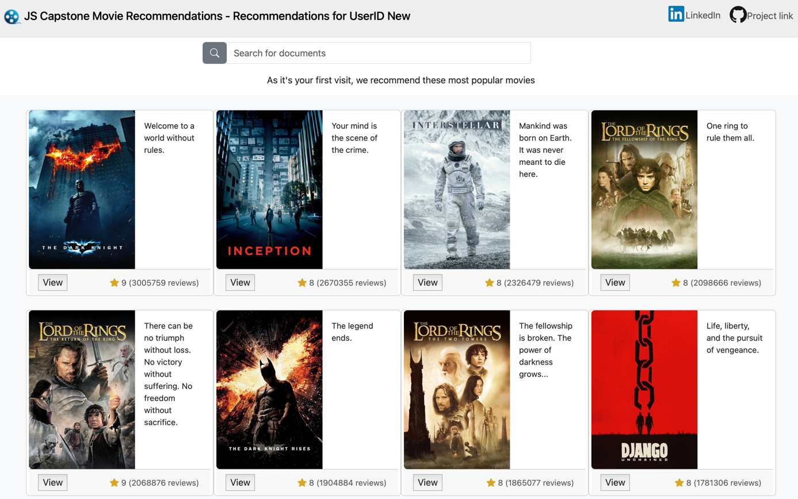

## Udacity Data Science Nanodegree
---
## Capstone Project: Movie Recommendation Web Application

#### Created by: Juanita Smith
#### Last date: April 2025

---

This project was completed as part of the 
[Data Science Nanodegree](https://www.udacity.com/enrollment/nd025) with Udacity.

This nanodegree mainly focused on effective communication with stakeholders,
building good coding practices for data scientists, 
and building recommendation systems.

My final capstone project brings together key concepts I learned in this course:

- Follow the **CRISP-DM** Process (Cross Industry Process for Data Mining)
- **Software Engineering**: Use object-oriented programming 
  to build my own classes and packages and using them in a web application
- **Data Engineering**: Building ETL and NLP pipelines 
  to gather, clean, and transform data
- **Recommendations systems**:
  Building a movie recommendation webapp using ranked-based,
  user-based collaborative filtering and NLP content-based algorithms.

### Table of contents

* [1. Project Overview](#1-project-overview)
* [2. Udacity Project requirements](#2-udacity-project-requirements)
* [3. Installation](#3-installation)
* [4. Instructions](#4-instructions)
* [5. Language translator with CHATGPT (optional step)](#5-language-translator-with-chatgpt-optional-step)
* [6. Input File Descriptions](#6-input-file-descriptions)
* [7. Modelling](#7-modelling)
  * [Data cleaning](#data-cleaning)
  * [Modelling approach](#modelling-approach)
    * [Dealing with Imbalance](#dealing-with-imbalance)
    * [Cross-validation](#cross-validation)
    * [Evaluation metrics](#evaluation-metrics)
    * [Model performance](#model-performance)
* [8. Flask Web App](#8-flask-web-app)
* [9. Skills learned:](#9-skills-learned)
* [10. Licensing, Authors, Acknowledgements](#10-licensing-authors-acknowledgementsa-namelicensinga)
* [11. References](#11-references)

# 1. Project Definition

## Project Overview

Build a movie recommendation web application by
using a blend of recommendation techniques such as ranked-based, content-based,
and collaborative filtering to make personalized movie recommendations to users.

Datasets containing over one million movies from TMDB and IMDB were sourced from Kaggle 
and blended with rating and tag data from MovieLens.

As all popular movie platforms like Netflix are customer-focused,
where an account is needed to watch movies,
and recommendations are personalized to the customer,
I will build the web application in the same spirit to be user-focussed.

## Problem Statement

Build a movie recommendation web application
that accurately predicts movies a user is likely to enjoy,
based on their past viewing history and rating patterns.

Recommending the right movie to the right user
is a crucial skill to learn to ensure a positive user experience
that helps companies like Netflix retain their customers.

The project is divided into the following parts:

- Part 1 — Preparation Phase:
The CRISP-DM process is followed in two preparation notebooks
  to help to refine the project in incremental steps.
  
Use notebooks to first collect, clean and explore data,
then explore and test various movie recommendation techniques.

- Part 2 — Deployment phase: Build ETL pipelines and web application
- Build ETL and NLP pipelines for automated data wrangling
- Transfer recommendation code from notebook to a recommender class and develop the web application

## Metrics

Different metrics are used for different recommendation algorithms:

#### Ranked-Based Metrics

  IMDB is often seen as the industry standard when it comes to movies;
  therefore, both 'IMDB number of votes' and 'IMDB average rating'
  were considered
  good choices to identify the top 20 most liked movies.
  
  Upon analysis, IMDB number of votes gave the best results,
  as it returned recognizable top movies known to me,
  with an average IMDB rating > 7.5.

**Top movies using IMDB number of votes:**

#### User-based Collaborative Filtering Metrics

Collaborative filtering focuses on neighborhood similarities,
meaning we look for similar users to the main user
and recommend movies the main user has not watched yet,
but his closest neighbors have.

Cosine similarity is used to find similar users. 

Cosine similarity measures the similarity between users 
based on the angle between their rating vectors, 
focusing on directional alignment rather than magnitude, 
making it robust to differences in scale and suitable for high-dimensional data. 

#### NLP Content-Based Metrics:

Another method we can use to make recommendations is
to recommend movies with the highest text-based cosine similarity 
to an input search term, using tfidf vectorization.

Cosine similarity measures the angle between two vectors.
The angle between similar vectors are close together.

Cosine similarity focus on the direction of vectors,
instead of magnitude,
making it useful for comparing text
that might have different lengths.

# 2. Analysis

## 2.1 Data Exploration

A blend of various data sources from IMDB,
TMDB, and MovieLens were chosen for this project.
 
See below a summary of the raw datasets
downloaded automatically and the columns of interest used in the project.

#### a) Kaggle TMDB/IMDb dataset containing content for over one million movies.

---
   
See full documentation available
   [here](https://www.kaggle.com/datasets/alanvourch/tmdb-movies-daily-updates/data)

This dataset is refreshed daily 
and contains up-to-date data to release year 2025.
It contains comprehensive data with 28 columns.

#### b) Kaggle Extra IMDb data

---

Dataset has similar data as IMDB/TMDB dataset,
but with additional interesting columns that improve the website appearance
and content-based recommendations.
This dataset is not kept up to date,
therefore, it wasn’t chosen as the main movie data source.

Full documentation is available in Kaggler [here'](https://www.kaggle.com/datasets/shubhamchandra235/imdb-and-tmdb-movie-metadata-big-dataset-1m)

#### c) MovieLens 32M

---
   
See documentation available on GroupLens [here](https://grouplens.org/datasets/movielens/32m/) or [here](https://files.grouplens.org/datasets/movielens/ml-32m.zip)

IMDb dataset doesn't have any ratings data by user id, 
which we need for user-item collaborative filtering.

The dataset contains 32 million ratings and two million tag applications applied to 87,585 movies by 200,948 users.
Collected 10/2023 Released 05/2024

The zip file contains several datasets,
of which the following are used in this project:

##### c.1) links.csv
This dataset enables us to join data from TMDB, IMDB, and MovieLens together.
In this project imdbId are used as the main unique identifier.

##### c.2) ratings.csv
This dataset contains movie ratings by user and movie

##### c.3) tags.csv
This dataset contains tags users gave to movies,
example 'disney', 'family', etc.

## 2.2 Data Visualization

As the recommendation project is user-focused,
we need to find a way to evaluate the quality of the movie recommendations. 

Let's profile a user based on the genres they like most.

Drama, Comedy, and Thrillers seem to be the most popular genres.
  

Here we have two users that have opposite tastes in movies 
and should get totally different recommendations from our web app.
 

# 3. Methodology

## 3.1 Data Preprocessing

A preprocessing pipeline `src/pipeline_preprocessing` was created,
which runs three preprocessing scrips and unit tests in sequence:
1) Data gathering (`src/preprocessing_data_gathering.py`)
2) Data cleaning (`src/preprocessing_data_cleaning.py`)
3) NLP preprocessing (`src/preprocessing_nlp`)
4) Unit testing (`tests/test_recommender.py`)

Estimated runtime 5-10 minutes depending on your local environment.

#### Data gathering

---
Data sources are downloaded automatically using kaggle API or via URL.

#### Data Cleaning

---

Data sources where cleaned and joined
using `imdbId` as the unique movie identifier,
via the MovieLens `links.csv` dataset. 
See final data model created during the data cleaning preprocessing step
and stored in `/data/clean/` as parquet files
to preserve data types and optimized storage.

Main cleaning activities:

- `imdb_id` was transformed into an integer as `imdbId`
  by dropping leading characters e.g., from tt10655524 to 10655524,
  to allow joining with MovieLens datasets
- To manage data volume and web app performance, datasets was filtered to contain only: 
    - English movies
    - Movies released since year 2000
    - `imdb_id` is not null, as it's a crucial identifier to link to other datasets like the `ratings.csv` dataset
    - Have a least 20 votes in IMDB dataset and 1 vote in TMDB dataset
    - Have IMDB rating of at least 3
    - Have a duration of at least 60 minutes to be seen as a movie (in my opinion)
- Datasets contain no duplicate records with acceptable levels of missing values in text fields. 
- To support NLP content-based recommendations:
  - all user tags were consolidated into one `all_texts` column summarized by movie
  - tags were merged with other text columns: 'title', 'overview', 'tagline', 'genres', 'director', 'producers', 'star1', 'star2', 'star3', 'star4', 'production_companies'
- To support collaborative filtering recommendations, ratings from MovieLens was used and linked with id `imdb_id`.  

Summary statistics after cleaning:  
- The number of unique IMDB/TMDB movies: 44,850
- The number of unique users who rated at least 20 movies in MovieLens: 96,699
- The number of unique movies that have at least 10 ratings in MovieLens: 11,583
- The number of user-movie ratings in the dataset: 12,078,741
- The number of movies that have been tagged: 14 263
- The number of movies that have homepages: 16,462

#### NLP preprocessing:

---

To overcome performance issues in the web application with data volume of 44k movies,
10k users, and over 12 mil ratings,
a preprocessing script creates the user-item matrix,
tfidf vector, and model in advance.
Artifacts are save in `\models` as parquet files where applicable.

#### Unit testing:

---

Unit tests were developed
to make sure:
- Datasets have the correct structure and content,
- No duplicate records
- Correctly return the most similar user for test users 103012 and 2704 for collaborative filtering
- Correctly return the movie with highest cosine similarity for a search for content-based filtering

This gives peace of mind
that programming changes doesn’t change the expected results.

## 3.2 Implementation

**Summary of the recommendation algorithms used:** 

#### Handling data sparsity

To handle sparsity
when creating the user-item matrix for collaborative filtering,
center each user's ratings around 0,
by deducting the row average and then filling the missing values with 0.
This means missing values are replaced with neutral scores.

This is not a perfect solution as we lose interpretability,
but if we use these values only to compare users, it's ok.

Because we centered the data around 0,
the cosine values will range from -1 to 1.
1 means it's the most similar, -1 means its the least similar

## 3.3 Refinement

- Overcome performance issues by reducing the scope of movies 
  and creating preprocessing scripts
  to create the necessary data and models upfront.
  Website start-up runtime improved from 2-3 minutes to 2-3 seconds.
  
- IMDB dataset `cast` column contained all actors of a movie. 
  A search term like `Julia Roberts`
  returned movies with actresses with name `Julia`,
  but with different surnames.
  
  By using an additional dataset and columns `star1, star2, star3, star4` instead,
  which only contained the main actors, improved the recommendations.
  

# 4. Results

## 4.1 Model Evaluation and Validation

### Ranked-Based Recommendations

---

Ranked-based recommendations correctly returned the expected top 20 movies
described above in the metrics section.

### User-Item Collaborative Filtering

---

##### Test 1: User 103013, who likes romance, drama and comedy movies

For our test user 103013, the most similar user selected is 2704.
If we compare the genres of the movies they rated, we get excellent similarity.

Movies recommended for user 103013 are indeed drama, comedy, or romance.

##### Test 2: User 105189, who likes adventure, action, and fantasy movies

For second test user 150189, the most similar user selected was 109980.
Again, he genre distribution is perfectly aligned.

Movies recommended for user 150189 are indeed action,
fantasy, superhero, thrillers.

### Content-Based Recommendations

---

When using search terms like 'batman'
or 'animal-themed superhero', similar movies in context are recommended.

## 4.2 Justification

Using cosine similarity to find similar users in collaborative filtering,
and for text similarity in content-based filtering is working well.

Relevant movies are being recommended.

# 5. Conclusion

## 5.1 Reflection

The process used for this project can be summarized using the following steps:

## 5.2 Improvement

Content-based filtering is using a bag-of-words concept
that doesn’t understand contextual meaning 
but simply matches words from the input search to the movie corpus.

Feeling inspired by this
[medium blog post](https://medium.com/data-science/recreating-andrej-karpathys-weekend-project-a-movie-search-engine-9b270d7a92e4),
experiment with LLM
to explore
if building recommendations
using a model like those from OpenAI or Hugging Face
that understand contextual meaning between words and sentences
and make better recommendations.

# 2. Installation
To clone the repository use `git clone https://github.com/JuanitaSmith/capstone_movie_recommendation.git`

- Project environment was built using Anaconda.
- Python 3.10 interpreter was used.
- Refer to `requirements.txt` for explicit libraries and versions needed to build your environment.
- Refer to `environment.yaml` for the full environment setup and channels used
- Note: Library `kaggle` and `kaggle-hub` was installed using pip as it's not available in conda

# 4. Instructions
Run the following commands in the project's **root directory** to set up your database and model.

A configuration file `src/config.pg` contains defaults for the project structure and file paths. 
Ideally don’t change this structure.

**IMPORTANT**: MAKE SURE ALL COMMANDS ARE RUN FROM THE TERMINAL IN THE MAIN PROJECT ROOT

python -m src.preprocessing_data_gathering
python -m src.preprocessing_data_cleaning
python -m src.preprocessing_nlp
python -m unittest tests.test_recommender
python runmovieapp.py  

# 8. Flask Web App

User can input a message, select the genre, and click on the button 'Classify Message'.

The saved classification model will be used to classify the message.
All positive classes will be highlighted in green.

# 9. Skills learned:

Skills applied in this project:

- Web Development using Flask, Plotly, and Software Engineering
- Clean and modular code, see custom modules and classes
- GIT version control
- Automated unit testing using library `unittest`, see folder `tests`
- Logging: see folder `logging` for logging results
- Introduction to Object-Oriented Programming - see `src/translator.py` and `mloversampler.py` for custom classes
- Data Engineering: Building pipelines using `scikit-learn` `Pipeline`

# 10. Licensing, Authors, Acknowledgements

Must give credit to Appen for the data.

* Movies dataset (Licence: [CCO: Public Domain](://www.kaggle.com/datasets/jrobischon/wikipedia-movie-plots))
* Wikipedia Movie Plots (License: [CC BY-SA 4.0](https://creativecommons.org/licenses/by-sa/4.0/)

# 11. References

[Kaggle movies dataset](https://www.kaggle.com/datasets/yashgupta24/48000-movies-dataset/data)
[Wikipedia Movie PLots dataset](https://www.kaggle.com/datasets/jrobischon/wikipedia-movie-plots)
[Building a movie recommender with OpenAI embeddings](https://medium.com/towards-data-science/recreating-andrej-karpathys-weekend-project-a-movie-search-engine-9b270d7a92e4)
[Movie Plots from Wikipedia](https://www.kaggle.com/datasets/kartikeychauhan/movie-plots)