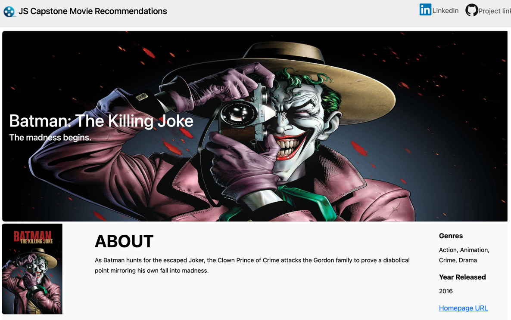

## Udacity Data Science Nanodegree
---
## Capstone Project: Movie Recommendation Web Application

#### Created by: Juanita Smith
#### Last date: April 2025

---

This project was completed as part of the 
[Data Science Nanodegree](https://www.udacity.com/enrollment/nd025) with Udacity.

This nanodegree mainly focused on effective communication with stakeholders,
building good coding practices for data scientists, 
and building recommendation systems.

My final capstone project brings together key concepts I learned in this course:

- Follow the **CRISP-DM** Process (Cross Industry Process for Data Mining) to approach a data science project.
- **Software Engineering**: Use object-oriented programming 
  to build my own classes and packages
  and use them in a web application build with Bootstrap and Flask
- **Data Engineering**: Building ETL and NLP pipelines 
  to gather, clean, and transform data
- **Recommendations systems**:
  Building a movie recommendation webapp using ranked-based,
  user-item collaborative filtering and NLP content-based algorithms.

### Table of contents

* [1. Project Definition](#1-project-definition)
  * [Project Overview](#project-overview)
  * [Problem Statement](#problem-statement)
  * [Metrics](#metrics)
* [2. Analysis](#2-analysis)
  * [2.1 Data Exploration](#21-data-exploration)
  * [2.2 Data Visualization](#22-data-visualization)
* [3. Methodology](#3-methodology)
  * [3.1 Data Preprocessing](#31-data-preprocessing)
  * [3.2 Implementation](#32-implementation)
  * [3.3 Refinement](#33-refinement)
* [4. Results](#4-results)
  * [4.1 Model Evaluation and Validation](#41-model-evaluation-and-validation)
  * [4.2 Justification](#42-justification)
* [5. Conclusion](#5-conclusion)
  * [5.1 Reflection](#51-reflection)
  * [5.2 Improvement](#52-improvement)
* [6. Project Installation](#6-installation)
* [7. Instructions](#7-instructions)
    * [Step 1. Set up a Kaggle API token](#step-1-set-up-a-kaggle-api-token)
    * [Step 2: Run notebook preparations](#step-2-run-notebook-preparations)
    * [Step 3: Run ETL pipelines](#step-3-run-etl-pipelines)
    * [Step 4: Run the web app locally](#step-4-run-the-web-app-locally)
* [8. Web Application Overview](#8-web-application-overview)
* [9. Licensing, Authors, Acknowledgements](#9-licensing-authors-acknowledgementsa-namelicensinga)
* [10. References](#10-references)

# 1. Project Definition

## Project Overview

Build a movie recommendation web application by
using a blend of recommendation techniques such as ranked-based, content-based,
and collaborative filtering to make personalized movie recommendations to users.

Datasets containing over one million movies from TMDB and IMDB were sourced from Kaggle 
and blended with rating and tag data from MovieLens.

As all popular movie platforms like Netflix are customer-focused,
where an account is needed to watch movies,
and recommendations are personalized to the customer,
I will build the web application in the same spirit to be user-focussed.

## Problem Statement

Build a movie recommendation web application
that accurately predicts movies a user is likely to enjoy,
based on their past viewing history and rating patterns.

Recommending the right movie to the right user
is a crucial skill to learn to ensure a positive user experience
that helps companies like Netflix retain their customers.

## Metrics

Different metrics are used for different recommendation algorithms:

* For Ranked-Based recommendations, use IMDB number of votes `imdb_votes`
to rank the top 20 movies
to suggest to new users or users with limited rating data.

  **Expected results:**  
  

- **Cosine Similarity** will be used as the metric
  to find similar users in collaborative filtering and similar texts in content-based recommendations.
  
  Cosine similarity measures the angle between two vectors.
  The angle between similar vectors is close together.
  
  Cosine similarity is a popular choice for NLP,
  as it focus on the direction of vectors,
  instead of magnitude,   making it useful for comparing text
  that might have different lengths.
  
  

# 2. Analysis

## 2.1 Data Exploration

A blend of various data sources from IMDb,
TMDB, and MovieLens were chosen for this project.
 
See below a summary of the raw datasets
downloaded automatically and the columns of interest used in the project.

#### a) Kaggle TMDB/IMDb dataset containing content for over one million movies.

---
   
See full documentation available
   [here](https://www.kaggle.com/datasets/alanvourch/tmdb-movies-daily-updates/data)

This dataset is refreshed daily 
and contains up-to-date data to release year 2025.
It contains comprehensive data with 28 columns.

#### b) Kaggle Extra IMDb data

---

Dataset has similar data as IMDb/TMDB dataset above,
but with additional interesting columns that improve the website appearance
and content-based recommendations.
This dataset is not kept up to date,
therefore, it wasn’t chosen as the main movie data source.

Full documentation is available in Kaggle [here'](https://www.kaggle.com/datasets/shubhamchandra235/imdb-and-tmdb-movie-metadata-big-dataset-1m)

#### c) MovieLens 32M

---
   
See documentation available on GroupLens [here](https://grouplens.org/datasets/movielens/32m/) or [here](https://files.grouplens.org/datasets/movielens/ml-32m.zip)

IMDb dataset doesn't have any ratings data by user id, 
which we need for user-item collaborative filtering.

The dataset contains 32 million ratings and two million tag applications applied to 87,585 movies by 200,948 users.
Collected 10/2023 Released 05/2024

The zip file contains several datasets,
of which the following are used in this project:

##### c.1) links.csv
This dataset enables us to join data from TMDB, IMDB, and MovieLens together.
In this project imdbId are used as the main unique identifier.

##### c.2) ratings.csv
This dataset contains movie ratings by user and movie

##### c.3) tags.csv
This dataset contains tags users gave to movies,
example 'disney', 'family', etc.

## 2.2 Data Visualization

As the recommendation project is user-focused,
we need to find a way to evaluate the quality of the movie recommendations. 

Let's profile a user based on the genres they like most.

Drama, Comedy, and Thrillers seem to be the most popular genres.
  

Here we have two users that have opposite tastes in movies.
 
They should get totally different recommendations from our web app.
 

# 3. Methodology

## 3.1 Data Preprocessing

A preprocessing pipeline `src/pipeline_preprocessing` was created,
which runs three preprocessing scrips and unit tests in sequence:
1) Data gathering (`src/preprocessing_data_gathering.py`)
2) Data cleaning (`src/preprocessing_data_cleaning.py`)
3) NLP preprocessing (`src/preprocessing_nlp`)
4) Unit testing (`tests/test_recommender.py`)

Estimated runtime is 5-10 minutes depending on your local environment.

#### Data gathering

---
Data sources are downloaded automatically using kaggle API or via URL.
Data are stored in `data/raw`.

Note: Due to data size over 1 gb, data is not published to GitHub

#### Data Cleaning

---

Data sources where cleaned and joined
using `imdbId` as the unique movie identifier,
via the MovieLens `links.csv` dataset. 
See final data model created during the data cleaning preprocessing step
and stored in `/data/clean/` as parquet files
to preserve data types and optimized storage.

Clean data is published to GitHub

Main cleaning activities:

- `imdb_id` was transformed into an integer as `imdbId`
  by dropping leading characters e.g., from tt10655524 to 10655524,
  to allow joining with MovieLens datasets
- To manage data volume and web app performance, datasets was filtered to contain only: 
    - English movies
    - Movies released since year 2000
    - `imdb_id` is not null, as it's a crucial identifier to link to other datasets like the `ratings.csv` dataset
    - Have a least 20 votes in IMDB dataset and 1 vote in TMDB dataset
    - Have IMDB rating of at least 3
    - Have a duration of at least 60 minutes to be seen as a movie (in my opinion)
- Datasets contain no duplicate records with acceptable levels of missing values in text fields. 
- To support NLP content-based recommendations:
  - all user tags were consolidated into one `all_texts` column summarized by movie
  - tags were merged with other text columns: 'title', 'overview', 'tagline', 'genres', 'director', 'producers', 'star1', 'star2', 'star3', 'star4', 'production_companies'
- To support collaborative filtering recommendations, ratings from MovieLens was used and linked with id `imdb_id`.  

Summary statistics after cleaning:  
- The number of unique IMDB/TMDB movies: 44,850
- The number of unique users who rated at least 20 movies in MovieLens: 96,699
- The number of unique movies that have at least 10 ratings in MovieLens: 11,583
- The number of user-movie ratings in the dataset: 12,078,741
- The number of movies that have been tagged: 14 263
- The number of movies that have homepages: 16,462

#### NLP preprocessing:

---

To overcome performance issues in the web application with data volume of 44k movies,
10k users, and over 12 mil ratings,
a preprocessing script creates the user-item matrix,
tfidf vector, and model in advance.
Artifacts are save in `\models` as parquet files where applicable.

Due to large data volumes over 2 gb, the data is not published to GitHub,
but can be generated by running the script.

#### Unit testing:

---

Unit tests were developed
to make sure:
- Datasets have the correct structure and content,
- No duplicate records
- Correctly return the most similar user for test users 103012 and 2704 for collaborative filtering
- Correctly return the movie with highest cosine similarity for a search for content-based filtering

This gives peace of mind
that programming changes doesn’t change the expected results.

## 3.2 Implementation

**Summary of the recommendation algorithms used:** 

#### Handling data sparsity

To handle sparsity
when creating the user-item matrix for collaborative filtering,
center each user's ratings around 0,
by deducting the row average and then filling the missing values with 0.
This means missing values are replaced with neutral scores.

This is not a perfect solution as we lose interpretability,
but if we use these values only to compare users, it's ok.

Because we centered the data around 0,
the cosine values will range from -1 to 1.
1 means it's the most similar, -1 means its the least similar

## 3.3 Refinement

- Overcome performance issues by reducing the scope of movies 
  and creating preprocessing scripts
  to create the necessary data and models upfront.
  Website start-up runtime improved from 2-3 minutes to 2-3 seconds.
  
- IMDB dataset `cast` column contained all actors of a movie. 
  A search term like `Julia Roberts`
  returned movies with actresses with name `Julia`,
  but with different surnames.
  
  By using an additional dataset and columns `star1, star2, star3, star4` instead,
  which only contained the main actors, improved the recommendations.
  

# 4. Results

## 4.1 Model Evaluation and Validation

### Ranked-Based Recommendations for new users (cold start)

---

Ranked-based recommendations
that are used for new users, correctly returned the expected top 20 movies
described above in the metrics section.

### User-Item Collaborative Filtering for users with historical rating data

---

##### Test 1: User 103013, who likes romance, drama and comedy movies

For our test user 103013, the most similar user selected is 2704.
If we compare the genres of the movies they rated, we get excellent similarity.

Movies recommended for user 103013 are indeed drama, comedy, or romance.

##### Test 2: User 105189, who likes adventure, action, and fantasy movies

For second test user 150189, the most similar user selected was 109980.
Again, he genre distribution is perfectly aligned.

Movies recommended for user 150189 are indeed action,
fantasy, superhero, thrillers.

### Content-Based Recommendations for text-similarity searches

---

When using search terms like 'batman'
or 'animal-themed superhero', similar movies in context are recommended.

## 4.2 Justification

### Ranked-Based Recommendations

Ranked-based recommendation is a good solution
for handing a cold start problem for users with no or little historical data.
IMDb is often seen as the industry standard
when it comes to movies and contains comprehensive data and IMDb ratings.
Therefore, both IMDb number of votes and IMDb average rating
were considered good choices to identify the top 20 most liked movies.

Upon analysis, IMDB number of votes gave the best results,
as it returned recognizable top movies known to me,
with an average IMDB rating > 7.5.

When I used IMDB average ratings,
it returned unknown movies with high ratings,
but with significantly fewer votes.

### Collaborative Filtering

Good results were obtained pretty fast,
again due to using high-quality datasets from IMDb and MovieLens,
which already contained quite clean data.

During the cleaning step,
only users were kept who rated at least 20 movies,
which means we give the algorithm a good starting point to find similar users.

Only movies were kept
that received at least 10 IMDb votes with a rating of at least 3,
making sure we give good quality recommendations.

Using cosine similarity to find similar users in collaborative filtering,
and for text similarity in content-based filtering is working well.
As we can see above, relevant movies are returned.

### Text-similarity context-based Filtering

The success of the text search lies in using user tag data from MovieLens,
and combing it with text data from IMDb to build a large corpus.
The tagline and overview columns from IMDb are quite detailed,
which makes this search successful. 

# 5. Conclusion

## 5.1 Reflection

Using a combination of ranked-based,
user-item collaborative filtering and context-based recommendation methods
to build a user story and flow for the web application is working well.

It was hard to find a single data source
that contained all the necessary information,
however, being able
to blend several good quality data sources is a success factor to great recommendations 
and was worth the effort.

The main steps of this project are, following the CRISP-DM process:
(Cross Industry Process for Data Mining)

1) Business understanding: Design the scope and flow of the web application.
2) Data Understanding: Explore data sources available to build the required recommendations.
   
First in notebooks: `/notebooks`  
3) Data Preparation: Gather, wrangle, and analyze the data to prepare it for modeling.  
4) Data modeling: Design and refine recommendation algorithms.  
5) Evaluate the results: How well do we recommend movies to users?  

Transfer notebook code to packages and classes: `/src`
6) Build pipelines to gather, clean, prepare, and test data
7) Deployment: Build a web application using Bootstrap and Flask `/movierecommendationapp`

I found steps 5 to 7 the hardest.
Due to the nature of this project,
it is challenging to test the results when the website is user-oriented.
How do we understand a user, which user ids to select,
and how do we make sure the algorithm is working and select similar users?
I had to find test users manually, and
build genre pie charts to validate the results.

Web development and object-orientated programming is not my strongest skill;
this took some time to master. 

## 5.2 Improvement

1) Content-based filtering is using a bag-of-words concept
that doesn’t understand contextual meaning 
but simply matches words from the input search to the movie corpus.

* Feeling inspired by this
[medium blog post](https://medium.com/data-science/recreating-andrej-karpathys-weekend-project-a-movie-search-engine-9b270d7a92e4),
experiment with LLM
to explore
if building recommendations
using a model like those from OpenAI or Hugging Face
that understand contextual meaning between words and sentences
can make better recommendations.
   
2) Allow users to filter on genre

3) Allow users to select a movie and find similar movies using again NLP content-based search.

# 6. Project Installation
To clone the repository use `git clone https://github.com/JuanitaSmith/capstone_movie_recommendation.git`

- The project environment was built using Anaconda.
- Python 3.10 interpreter was used.
- Refer to `requirements.txt` for explicit libraries and versions needed to build your environment.
- Refer to `environment.yaml` for the full environment setup and channels used
- Note: Library `kaggle` and `kaggle-hub` was installed using pip as it's not available in conda

# 7. Instructions

Due to data size over 1 GB, raw data is not published to GitHub.
Raw data can be automatically downloaded to your local environment
by setting up Kaggle API authentication and running the scripts below.

Alternatively download the raw data manually as described in section `2.1 Data Exploration`

A configuration file `src/config.pg` contains defaults for the project structure and file paths. 
Ideally don’t change this structure.

### `Step 1. Set up a Kaggle API token`

Kaggle data is gathered automatically using kaggle API's.
To use the Kaggle API, you need to install the kaggle package by running:
`pip install kaggle`

Before using the API, you need to authenticate using an API token.
Follow the steps below to download the API token.

1) Create a Kaggle account for free at www.kaggle.com 
2) Go to your profile settings, click on the 'Account' tab and click on 'Create New Token'
This will download a file named `kaggle.json`
containing your API credentials.
3) Move the `kaggle.json` file to the appropriate location:
    * Linux/OSX: `~/.kaggle/kaggle.json`
    * Windows: `c:/Users/<username>/.kaggle/kaggle.json`
4) That's it, you’re done !

IMPORTANT:
Ensure `kaggle.json` is in the location `~/.kaggle/kaggle.json` to use the API.

Alternatively, the data can be downloaded manually and stored in below structure

### `Step 2: Run notebook preparations` (Optional)

2.1) Run notebook `/notebooks/1_ETL_pipeline_preparation,ipynb` 
to gather data automatically and wrangle data.

2.2) Run notebook `notebooks/2_recommendation_preparation.ipynb`
for data exploration and modeling

### `Step 3: Run ETL pipelines`
**IMPORTANT**: MAKE SURE ALL COMMANDS ARE RUN FROM THE TERMINAL IN THE MAIN PROJECT ROOT

Code from notebook 1 was transferred into several pipeline scripts.

To run the entire pipeline in one easy step, run the following command:  
`python -m src.pipeline_preprocessing`

The scripts can also be run individually in the following order:

1. `python -m src.preprocessing_data_gathering` (generate raw data)
2. `python -m src.preprocessing_data_cleaning` (generate clean data)
3. `python -m src.preprocessing_nlp` (generate model data)
4. `python -m unittest tests.test_recommender` (optional step)

A log file `logs\wrangling.log` will be track
and record all steps taken during wrangling.

### `Step 4: Run the web app locally`

Note: Preprocessing steps in step 3 should be completed first.
 
Data should exist in `/data/clean` and `/models` for the webapp to work.
 
**As a minimum, run script 3, as clean data is already published to GitHub**

Run the following command in the terminal at the main project root
to run the web app locally.

`python runmovieapp.py`

Enter your web browser and type `localhost:3001` to launch the web application.

A log file `logs\webapp.log` will be track all user activities on this site

# 8. Web Application Overview

Start by entering a user id and click 'Find Recommendations'.
 
To simulate a new user, enter user id = '0'.

#### New Users
Ranked-based recommendations will always show the same top movies.
 
Status bar indicates the type of user and recommendation technique used.

#### Collaborative filtering for users with historical ratings

This approach finds similar users
who watched the same movies as the input user  
and propose movies these similar users have watched,
that the input user has not yet seen.
 
Status bar indicates that collaborative filtering was used.

#### Search for movies by entering some text

This approach use NLP content-based recommendations.
 
The status bar indicate that content-based recommendations are used.

#### View 

To view more details about a movie,
click on 'View' button below the movie poster.

# 9. Licensing, Authors, Acknowledgements

Must give credit to Appen for the data.

* Movies dataset (Licence: [CCO: Public Domain](://www.kaggle.com/datasets/jrobischon/wikipedia-movie-plots))
* Wikipedia Movie Plots (License: [CC BY-SA 4.0](https://creativecommons.org/licenses/by-sa/4.0/)

# 10. References

- [Kaggle movies dataset](https://www.kaggle.com/datasets/yashgupta24/48000-movies-dataset/data)
- [Wikipedia Movie PLots dataset](https://www.kaggle.com/datasets/jrobischon/wikipedia-movie-plots)
- [Building a movie recommender with OpenAI embeddings](https://medium.com/towards-data-science/recreating-andrej-karpathys-weekend-project-a-movie-search-engine-9b270d7a92e4)
- [Movie Plots from Wikipedia](https://www.kaggle.com/datasets/kartikeychauhan/movie-plots)
- [Datacamp course on recommendations](https://app.datacamp.com/learn/courses/building-recommendation-engines-in-python)